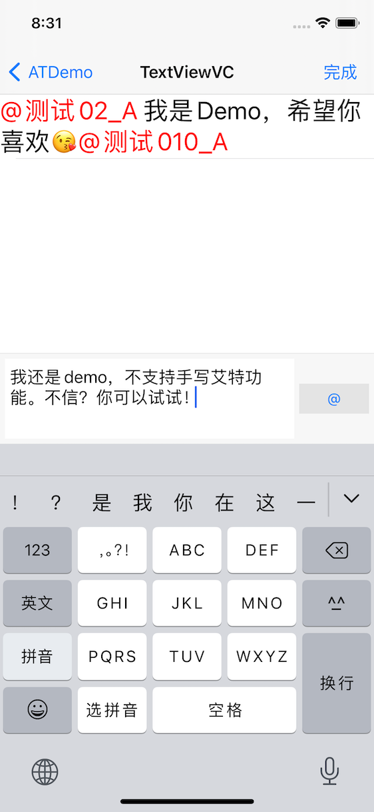

# ATDemo
用于仿微博、微信、钉钉的艾特（@）功能【话题功能类型处理】【swift 已经支持，但在维护中。。。】

* <strong>艾特所在的`特殊文本`不支持编辑，为一个整体存在</strong>

## 一、实现功能
- 以UITextView为基础实现，可以输入时支持`特殊文本`变色
- 支持 `特殊文本`列表输出（包含在文本中的定位信息、可以自定义其它内容），减少服务器的交互
- 富文本用 `YYLabel`显示，支持可点击
- 输入时，不支持艾特点击

## 二、效果图


## 三、如何使用

与UITextView使用一样，只是方法的拓展

1、导入头文件
```
#import "ATTextView.h"
```

2、使用时，集成ATTextView即可

3、插入话题或人名等特殊文本时，需要更新光标位置
```
    NSArray *results = self.textView.atUserList;

    NSLog(@"输出打印:");
    for (TextViewBinding *model in results) {
        NSLog(@"user info - name:%@ - location:%ld",model.name, model.range.location);
    }
```

4、获取已经拆入的话题或人名等特殊文本列表
```
- (void)updateUIWithUser:(User *)user {
        
    NSString *insertText = [NSString stringWithFormat:@"@%@ ", user.name];
    TextViewBinding *bindingModel = [[TextViewBinding alloc]initWithName:user.name
                                                                  userId:user.userId];

    // 插入前手动判断
//    if (self.textView.text.length+insertText.length > 20) {
//        NSLog(@"已经超出最大输入限制了....");
//        return;
//    }
    
    [self.textView insertText:insertText];
    NSMutableAttributedString *tmpAString = [[NSMutableAttributedString alloc] initWithAttributedString:self.textView.attributedText];
    NSRange range = NSMakeRange(self.textView.selectedRange.location - insertText.length, insertText.length);
    [tmpAString setAttributes:@{NSForegroundColorAttributeName:k_hightColor,
                                NSFontAttributeName:k_defaultFont,
                                TextBindingAttributeName:bindingModel}
                        range:range];

    // 解决光标在插入‘特殊文本’后 移动到文本最后的问题
    NSInteger lastCursorLocation = self.textView.cursorLocation;
    self.textView.attributedText = tmpAString;
    self.textView.selectedRange = NSMakeRange(lastCursorLocation, self.textView.selectedRange.length);
    self.textView.cursorLocation = lastCursorLocation;
}
```

## 四、说重点！！！
#### 1、通过实现UITextViewDelegate中的三个方法完成主要的核心操作

用于处理光标移动的逻辑
```
- (void)textViewDidChangeSelection:(UITextView *)textView
```

文本有改变时，重置attributedText属性
```
- (void)textViewDidChange:(UITextView *)textView
```

文本进行增、删、改时的处理逻辑
```
- (BOOL)textView:(UITextView *)textView shouldChangeTextInRange:(NSRange)range replacementText:(NSString *)text
```
#### 2、通过正则表达时，查找定位@符号列表数据

```
#define kATRegular      @"@[\\u4e00-\\u9fa5\\w\\-\\_]+ "
```
```
- (NSArray<TextViewBinding *> *)getResultsListArrayWithTextView:(NSAttributedString *)attributedString {
    __block NSMutableArray *resultArray = [NSMutableArray array];
    NSRegularExpression *iExpression = [NSRegularExpression regularExpressionWithPattern:kATRegular options:0 error:NULL];
    [iExpression enumerateMatchesInString:attributedString.string
                                  options:0
                                    range:NSMakeRange(0, attributedString.string.length)
                               usingBlock:^(NSTextCheckingResult *result, NSMatchingFlags flags, BOOL *stop) {
        NSRange resultRange = result.range;
        NSString *atString = [self.text substringWithRange:result.range];
        TextViewBinding *bindingModel = [attributedString attribute:TextBindingAttributeName atIndex:resultRange.location longestEffectiveRange:&resultRange inRange:NSMakeRange(0, atString.length)];
        if (bindingModel) {
            bindingModel.range = result.range;
            [resultArray addObject:bindingModel];
        }
    }];
    return resultArray;
}
```

## 五、文档参考
为了研究这个 `艾特` 功能花费了大量的时间和精力，也参考了网上许多的案例实现。

以下为主要参考文档链接，需要请查看：

1、[iOS中@功能的完整实现](https://blog.csdn.net/olsQ93038o99S/article/details/80730096)

2、[UITextView中，如何对特殊文本进行整体绑定](https://www.jianshu.com/p/891275b93d29)

### 更多问题请issue me！！！
